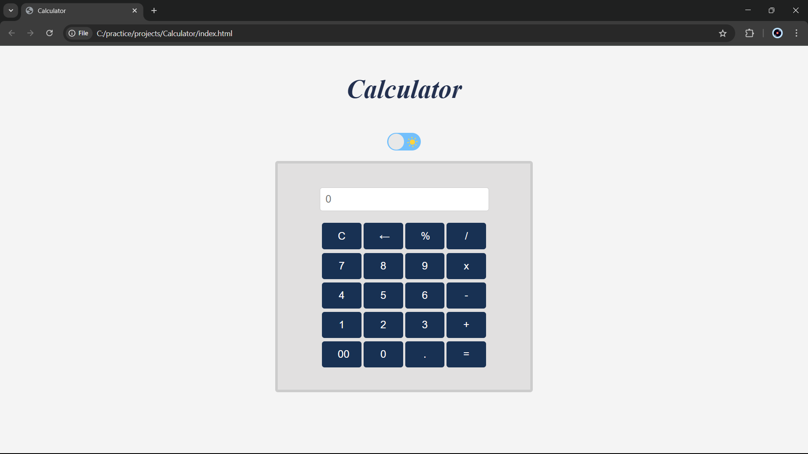

# Calculator Web Application

## Overview
This is a simple web-based calculator that allows users to perform basic arithmetic operations such as addition, subtraction, multiplication, and division. The calculator features a clean UI with a light/dark mode toggle.

## Features
- Basic arithmetic operations: Addition (+), Subtraction (-), Multiplication (×), and Division (/)
- Percentage (%) and decimal point (.) support
- Clear (C) and backspace (←) functions
- Double zero (00) button for quick input
- Light/Dark mode toggle

## Technologies Used
- HTML
- CSS
- JavaScript

## How to Use
1. Open the `index.html` file in a web browser.
2. Use the buttons to input numbers and operations.
3. Press `=` to compute the result.
4. Use `C` to clear the display or `←` to delete the last input.
5. Toggle the light/dark mode switch for a different theme.

## Installation
No installation is required. Simply download the project files and open `index.html` in your preferred web browser.

## Screenshot

## Future Improvements
- Add keyboard support for input
- Enhance UI with animations
- Implement scientific calculator functions

## Author
Developed by [Dhruv Baldev](https://github.com/dhruvb2204).

## License
This project is open-source and free to use under the MIT License.
